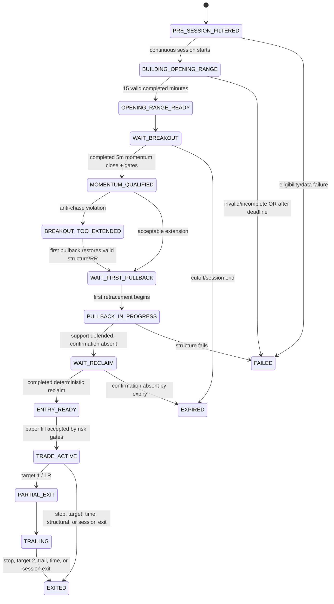

# ORB + First Pullback — Typed State-Machine Design

Status: Phase 1 proposal; no engine implementation exists in this change.

## Deterministic contract

The state machine is evaluated from an immutable event snapshot containing:

- canonical symbol and Cairo session date;
- evaluation timestamp in timezone-aware UTC and Cairo;
- completed 1m and 5m bars only;
- frozen EODHD D-1 context and explicit provider mappings;
- latest Rubix quote, quote age, collector status, bid/ask/spread availability;
- volume capability and history sample count;
- opening-range, breakout, pullback, reclaim, structural stop, target, and risk evidence;
- current paper position/risk state.

Every evaluation returns a typed state and an immutable decision record. It may not mutate frozen opening-range, breakout, stop, or trigger levels silently. No LLM participates in a transition.

## Global invariants

1. All exchange rules are evaluated in `Africa/Cairo`; storage timestamps are aware UTC.
2. Continuous strategy input is restricted to `[10:00, 14:15)` Cairo.
3. Auction observations `[14:15, 14:25)` are classified separately and cannot create or confirm an entry.
4. Opening range is `[10:00, 10:15)` and requires all fifteen completed minute slots or an explicit data-quality rejection; it is never based on the first fifteen rows.
5. A 5m confirmation consumes only a bar whose end timestamp is at or before the evaluation time.
6. The first breakout candle cannot itself produce `ENTRY_READY`.
7. Only the first qualifying pullback after the frozen breakout is eligible. Later pullbacks are recorded as `SECOND_PULLBACK_NOT_ELIGIBLE` and expire that activation.
8. A touch is not confirmation. Entry requires a completed reclaim/structure-break rule.
9. Stop, trigger, targets, risk amount, and quantity are frozen together when `ENTRY_READY` is recorded.
10. No averaging down, no stop widening, no state rollback that erases evidence, and no post-exit P&L accumulation.
11. Missing required data fails closed with its exact reason.
12. A state transition is idempotent by `(session_date, symbol, activation_id, prior_state, new_state, evidence_fingerprint)`.

## Primary states and Arabic labels

| State | Arabic label | Meaning |
|---|---|---|
| `PRE_SESSION_FILTERED` | مرشح قبل الجلسة | Passed D-1 eligibility and has verified Rubix mapping |
| `BUILDING_OPENING_RANGE` | جارٍ بناء النطاق الافتتاحي | Session is open but fifteen completed minutes are not yet available |
| `OPENING_RANGE_READY` | النطاق الافتتاحي مكتمل | OR levels frozen from valid completed 1m bars |
| `WAIT_BREAKOUT` | انتظار اختراق مؤكد | No completed qualifying 5m close above OR high |
| `MOMENTUM_QUALIFIED` | مؤهل للزخم — لا دخول بعد | Valid momentum evidence exists; first breakout is not an entry |
| `BREAKOUT_TOO_EXTENDED` | الاختراق ممتد — ممنوع المطاردة | Breakout violates extension/stop-distance/resistance/RR gate |
| `WAIT_FIRST_PULLBACK` | انتظار أول إعادة اختبار | Breakout is frozen and no qualifying retracement has begun |
| `PULLBACK_IN_PROGRESS` | أول إعادة اختبار قيد التكوين | The first controlled retracement is being measured |
| `WAIT_RECLAIM` | انتظار تأكيد استعادة المستوى | Support interaction is valid but completed confirmation is absent |
| `ENTRY_READY` | جاهز للدخول بعد تأكيد إعادة الاختبار | Trigger, structural stop, targets, risk and evidence are frozen; paper only |
| `TRADE_ACTIVE` | صفقة ورقية نشطة | A reproducible paper fill was recorded |
| `PARTIAL_EXIT` | خروج جزئي ورقي | Configured 1R partial was filled |
| `TRAILING` | إدارة الجزء المتبقي | Remaining size follows the configured completed-bar trail |
| `EXITED` | أغلقت الصفقة الورقية | Terminal paper outcome |
| `FAILED` | فشل النموذج | Terminal structural/data/gate failure with exact reason |
| `EXPIRED` | انتهت صلاحية الفرصة | Activation expired without a valid paper entry |
| `LATE_SESSION` | الوقت متأخر لدخول جديد | Entry cutoff reached; management only |
| `AUCTION_PHASE` | مرحلة مزاد الإغلاق — لا دخول جديد | Auction is isolated from continuous strategy logic |

`ENTRY_READY`, alerts, and trade panels always carry `SHADOW / PAPER / RESEARCH ONLY` and never broker instructions.

## High-level flow



At any nonterminal pre-entry state, entry cutoff moves the activation to `LATE_SESSION`; auction start moves it to `AUCTION_PHASE`. These states then terminate as `EXPIRED` for new-entry purposes. Existing paper trades remain manageable, but no new paper entry can be opened.

## Transition table

| From | Guard/event | To | Required frozen evidence |
|---|---|---|---|
| start | D-1 complete/current; liquidity/ATR/price/upside rules pass; verified mapping | `PRE_SESSION_FILTERED` | daily context hash, mapping, selection reasons |
| start | missing/stale D-1, bad mapping, invalid history | `FAILED` | exact pre-session rejection code |
| `PRE_SESSION_FILTERED` | pre-open | remains | no intraday calculation |
| `PRE_SESSION_FILTERED` | 10:00 reached with healthy feed | `BUILDING_OPENING_RANGE` | session identity, expected 15 slots |
| `BUILDING_OPENING_RANGE` | before all slots close | remains | completed count, missing slots, freshness |
| `BUILDING_OPENING_RANGE` | 15 valid slots closed at 10:15 | `OPENING_RANGE_READY` | OR high/low/mid/width/ATR/volume; turnover/VWAP only if supported |
| `BUILDING_OPENING_RANGE` | range cannot be formed after permitted data delay | `FAILED` | `OPENING_RANGE_NOT_COMPLETE` plus missing/invalid slots |
| `OPENING_RANGE_READY` | levels frozen | `WAIT_BREAKOUT` | OR fingerprint |
| `WAIT_BREAKOUT` | only a wick or incomplete 5m bar exceeds OR high | remains | `NO_VALID_BREAKOUT` |
| `WAIT_BREAKOUT` | completed 5m close over buffered OR high and all required gates pass | `MOMENTUM_QUALIFIED` | breakout bar, time, extension, volume quality, spread, freshness, resistance |
| `MOMENTUM_QUALIFIED` | extension/stop/RR/resistance gate fails | `BREAKOUT_TOO_EXTENDED` or `FAILED` | exact anti-chase measurements; terminal if structure cannot recover |
| `MOMENTUM_QUALIFIED` | first breakout cannot be entered | `WAIT_FIRST_PULLBACK` | breakout zone and activation id frozen |
| `WAIT_FIRST_PULLBACK` | first qualifying retracement begins | `PULLBACK_IN_PROGRESS` | pullback ordinal=1, reference levels |
| `WAIT_FIRST_PULLBACK` | no retracement by configured expiry/cutoff | `EXPIRED` | `PULLBACK_NOT_STARTED` or `ENTRY_EXPIRED` |
| `PULLBACK_IN_PROGRESS` | controlled depth/volume and support interaction, no reclaim yet | `WAIT_RECLAIM` | low, depth %, depth ATR, bars, volume behavior, OR/VWAP/EMA relationships |
| `PULLBACK_IN_PROGRESS` | decisive OR failure, lower-low failure, excessive depth, adverse volume | `FAILED` | one of the explicit failure codes |
| `WAIT_RECLAIM` | completed configured reclaim/previous-bar-high/structure break, risk gates pass | `ENTRY_READY` | rule, confirmation bar/time, trigger, stop, targets, RR, quantity inputs |
| `WAIT_RECLAIM` | VWAP/OR structure lost, stale data, cutoff, or second pullback | `FAILED`/`EXPIRED`/`LATE_SESSION` | exact reason |
| `ENTRY_READY` | next executable ask exists and account gates pass | `TRADE_ACTIVE` | unique signal id and paper fill |
| `ENTRY_READY` | quote stale, spread poor, risk/heat/loss cap, trigger expiry | `EXPIRED` or `FAILED` | execution rejection |
| `TRADE_ACTIVE` | 1R partial enabled and reached | `PARTIAL_EXIT` | fill, fees, remaining quantity |
| `PARTIAL_EXIT` | remainder exists | `TRAILING` | trail rule and initial non-widenable stop |
| active states | stop/target/time/structural/session rule | `EXITED` | conservative fill and exit evidence |

## Failure and block reasons

The state and reason are separate. `FAILED` is never shown without one or more localized reason codes.

### Required strategy reasons

- `OPENING_RANGE_NOT_COMPLETE`
- `NO_VALID_BREAKOUT`
- `BREAKOUT_TOO_EXTENDED`
- `PULLBACK_NOT_STARTED`
- `PULLBACK_TOO_DEEP`
- `PULLBACK_VOLUME_EXPANSION`
- `VWAP_LOST` only when genuine VWAP is available and is the defended structure
- `OPENING_RANGE_FAILED`
- `DAILY_RESISTANCE_TOO_CLOSE`
- `POOR_RISK_REWARD`
- `SPREAD_TOO_WIDE`
- `STALE_LIVE_DATA`
- `RUBIX_MAPPING_UNAVAILABLE`
- `INSUFFICIENT_INTRADAY_HISTORY`
- `LATE_SESSION`
- `AUCTION_PHASE`
- `ENTRY_EXPIRED`

### Additional data-quality reasons

- `SPREAD_UNAVAILABLE`
- `TURNOVER_UNAVAILABLE`
- `TRADE_COUNT_UNAVAILABLE`
- `TRUE_VWAP_INPUTS_UNAVAILABLE`
- `RVOL_UNAVAILABLE`
- `PROVISIONAL_VOLUME_PROXY_NOT_APPROVED`
- `COLLECTOR_UNHEALTHY`
- `QUOTE_LOCKED_OR_STALE`
- `INSUFFICIENT_OBSERVED_UPDATES`
- `ABNORMAL_PRICE_DISCONTINUITY`
- `DUPLICATE_EVENT_CONFLICT`
- `PARTIAL_BAR_NOT_COMPLETE`
- `SECOND_PULLBACK_NOT_ELIGIBLE`
- `STRUCTURAL_STOP_TOO_WIDE`
- `PORTFOLIO_HEAT_LIMIT`
- `DAILY_LOSS_LIMIT`
- `MAX_DAILY_LOSSES`

Unavailable optional evidence may be displayed as unavailable. Unavailable evidence configured as required blocks the transition.

## Pullback identity

An activation begins at the first valid completed breakout bar after the frozen opening range. Its breakout zone, reference levels, and sequence number are immutable. A pullback starts only when a later completed bar retraces from the post-breakout high toward a configured frozen reference. The engine records:

- ordinal (`1` required);
- first/last completed bar timestamps;
- post-breakout high and pullback low;
- depth percent and intraday ATR units;
- completed-bar count;
- valid selling volume relative to breakout volume, or unavailable state;
- distance to OR high and genuine VWAP if supported;
- closes below structure, lower-low evidence, and failure reason.

The engine must not use a future bar to decide that an earlier pullback was “controlled.” Evidence is appended as bars close; a later failure creates a later transition.

## Entry confirmation and frozen levels

Permitted confirmation rules are typed and configuration-selected, for example:

- `COMPLETED_CLOSE_RECLAIMS_OR_HIGH`
- `COMPLETED_CLOSE_RECLAIMS_TRUE_VWAP`
- `COMPLETED_CLOSE_ABOVE_PREVIOUS_BAR_HIGH`
- `BULLISH_REJECTION_HIGH_BROKEN_ON_LATER_COMPLETED_BAR`
- `SHORT_PULLBACK_STRUCTURE_BREAK`

`ENTRY_READY` requires at least one configured rule, a valid executable-price model, fresh quote, explicit spread state, volume state, structural stop, minimum RR, and account-risk capacity. A support touch alone is insufficient.

## Structural stop and sizing contract

Stop candidates are derived from the actual defended structure: pullback low, OR high, or genuine VWAP when it was the qualifying defense, plus a configurable intraday ATR buffer. The chosen structure and buffer are recorded. If the resulting distance exceeds the configured maximum, the candidate fails; the stop is not moved closer merely to manufacture RR.

Paper quantity is calculated from account equity and the executable entry-to-stop distance, then capped by exposure/liquidity/portfolio heat. Initial research risk is 0.25% of equity. Maximum concurrent ORB trades, daily loss count, daily realized loss and heat remain typed configuration, with no hard-coded account size.

## Trade-management substates

- Default research model candidate: optional partial at 1R, remainder toward 2R or meaningful resistance.
- Trail may use completed 5m higher lows or genuine VWAP only when configured and available.
- Time stop is evaluated after the configured number of completed 5m bars with no continuation.
- Stop is never widened. Adding to a losing position is prohibited.
- If stop and target touch in the same bar without tick ordering, stop-first conservative resolution is retained.
- Auction is not a new-entry phase; any end-of-session management rule must be explicit and separate.

## Transition record contract

Every transition stores at minimum:

```text
transition_id, session_date, canonical_symbol, activation_id,
evaluated_at_utc, evaluated_at_cairo, prior_state, new_state,
rule_code, reason_codes[], evidence_json, frozen_levels_json,
data_quality_json, config_hash, daily_context_hash,
source_cutoff_utc, source_fingerprint
```

Evidence JSON is versioned and numeric; localized UI labels are a presentation concern. Raw enums must never be shown directly in the dashboard.
